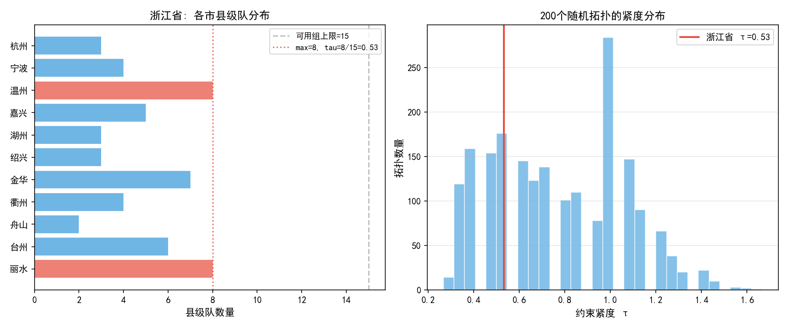
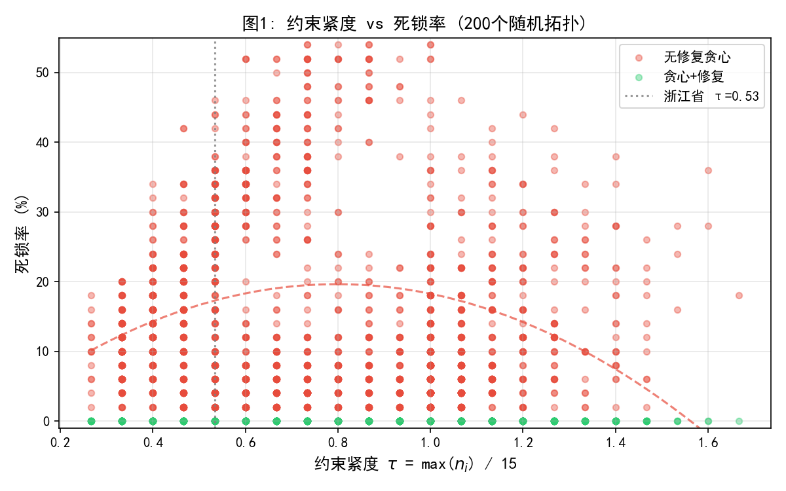
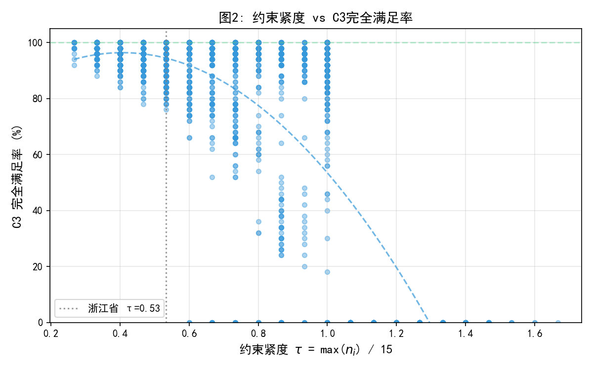
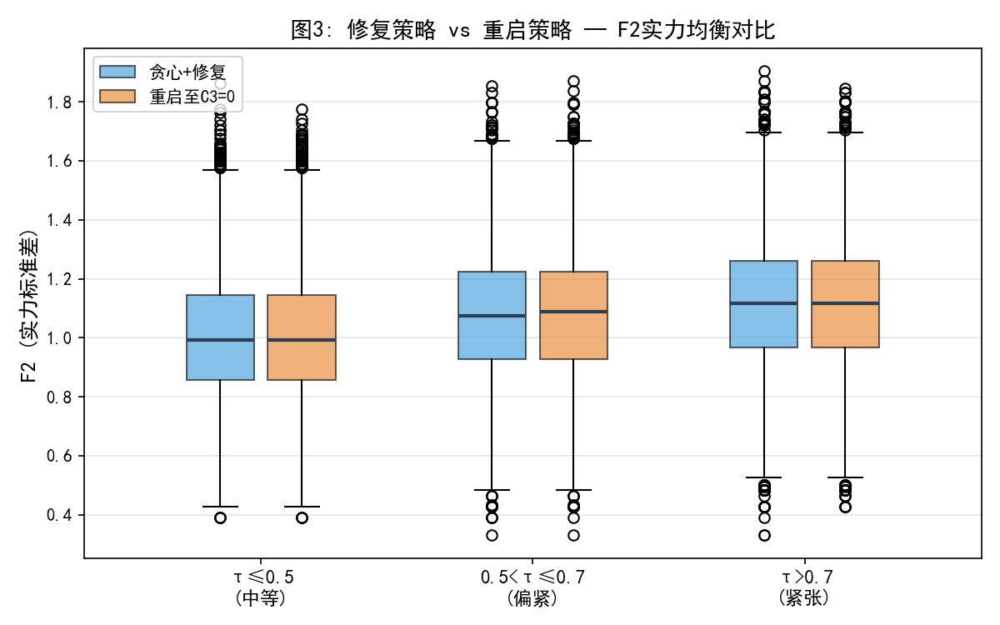
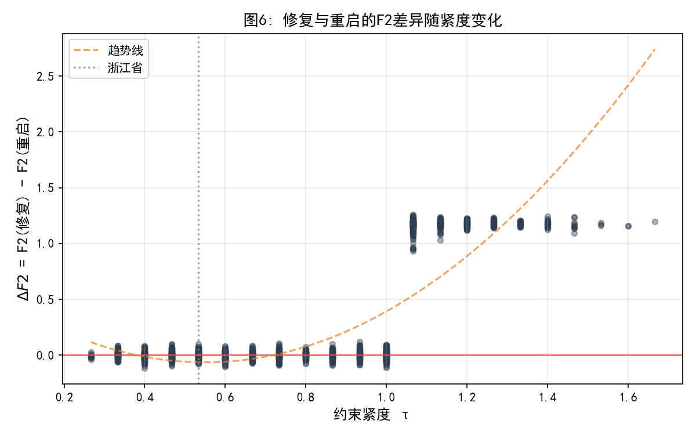
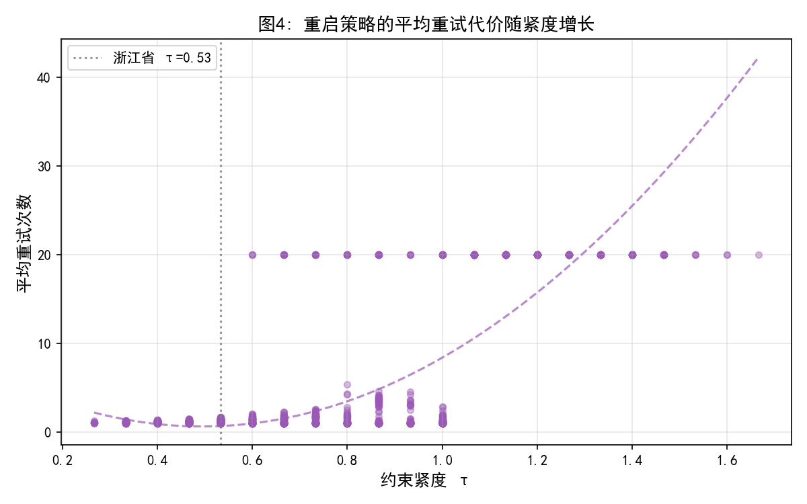
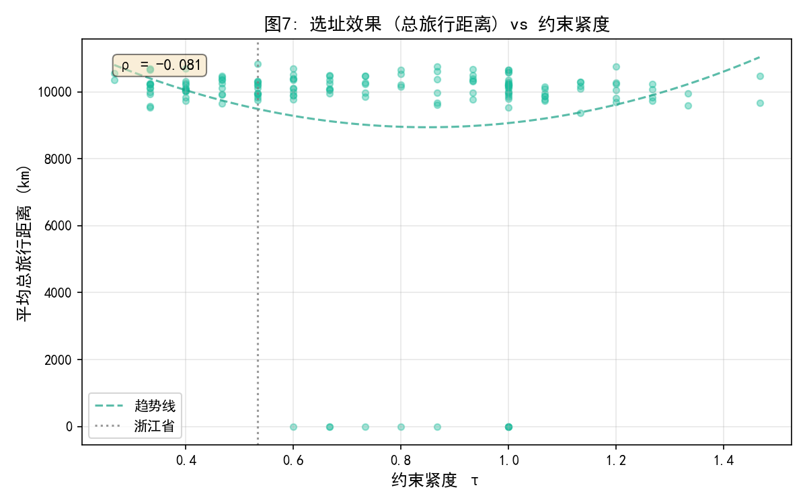
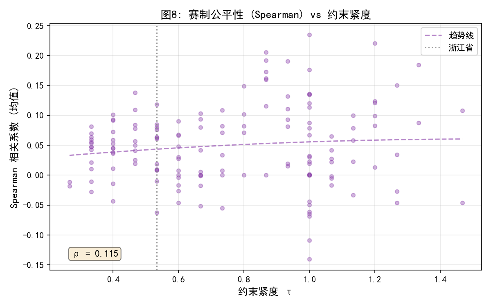
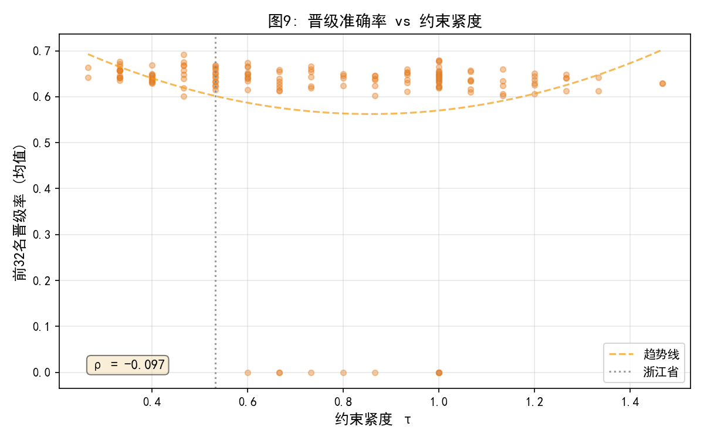

# Q2 抽签方案：两版实现对比分析

## 一、概览

本文档对比两套独立的"浙超"第二问抽签方案实现：

|  | 队友版本 | 我们的版本 |
|--|---------|-----------|
| 文件 | `a初始算法.py` / `b频率统计算法.py` / `c多次抽取算法.py`（已整合为 `teammate_draw_combined.py`） | `q2_draw.py`（依赖 `q1_grouping.py`） |
| 核心方法 | 单一策略：城市优先贪心 | 双策略：城市优先贪心 + 分档抽签 |
| 指标体系 | 仅 C3 违反数 | F1(C3冲突对) + F2(实力σ) + F2'(极差) + F3(多样性熵) |
| 蒙特卡洛 | 1000次 | 10000次 |
| 死锁处理 | 报错 / 重试整个抽签 | 修复机制（交换腾位） |

---

## 二、算法思路对比

### 2.1 共同的骨干流程

两版实现共享同一个核心框架：

1. **阶段1**：随机将11支市级队分配到16组中的11个不同组 → 保证 C1
2. **阶段2**：按各市"剩余县级队数量"从多到少，逐市取出全部县级队
3. 每支县级队从可用组（排除C2禁入组、已满组）中**贪心选择C3冲突最低的组**

### 2.2 关键差异

#### 差异1：整批处理 vs 逐队分散

| 步骤 | 队友版本 | 我们的版本 |
|------|---------|-----------|
| 选市策略 | 选出当前剩余**最多**的市，取出其**全部**县级队一次性处理完 | 相同：按县级队数降序排列各市，逐市处理 |
| 组内选择 | 贪心选C3最低组；同分随机 | 贪心选C3最低 + 人数最少组；同分随机 |

队友版本在选组时**不考虑组内人数均衡**，只看C3分数；我们的版本优先选C3最低的，同分时进一步选**人数最少**的组，有助于均衡填充。

#### 差异2：死锁处理

|  | 队友版本 | 我们的版本 |
|--|---------|-----------|
| 死锁发生时 | 抛异常 (`a`) 或返回失败 (`b`/`c`)，整体重试 | 调用 `_repair_swap()` 尝试修复 |
| 修复策略 | 无——只能从头重抽 | 从已满组中取一支其他市的县级队换入禁用组，腾出空位 |

`_repair_swap()` 的具体做法：

1. 找到当前队伍的C2禁入组（本市市级队所在组）
2. 如果禁入组还有空位（未满4队），从某个已满组中取出一支**其他市的**县级队
3. 将该县级队换入禁入组（前提是不违反其所属市的C2约束）
4. 被腾出空位的组即成为当前队伍的放置位置

这个修复机制确保了**0%的死锁率**（10000次模拟无一失败）。

#### 差异3：分档抽签法（仅我们）

队友版本只有一种抽签策略。我们额外实现了**分档抽签法**（类似FIFA世界杯抽签）：

- 将64队按实力分4档（市级+强县级市 / 县级市+县 / 县 / 县），每档16队
- 逐档抽取，每组从每档恰好放入1队
- 约束检查C1+C2+C3，C3不满足时放松回退

分档法在实际测试中表现不如城市优先法（8.2%失败率，仅31%满足C3），但作为对比方案有参考价值。

#### 差异4：评价指标

| 指标 | 队友版本 | 我们的版本 |
|------|---------|-----------|
| C3违反小组数 | ✅ | ✅（F1，但用冲突**对数**而非组数） |
| 单组最大同市县级队数 | ✅ | ✅ |
| 实力均衡（标准差） | ❌ | ✅（F2） |
| 实力极差 | ❌ | ✅（F2'） |
| 多样性熵（Shannon） | ❌ | ✅（F3） |
| 可行性理论证明 | ❌ | ✅（Hall婚配定理） |

#### 差异5：数据结构

队友版本使用简单的字典+列表，每支县级队仅记录 `{name, admin_city}`，不区分县级市和县。

我们的版本通过 `q1_grouping.py` 的 `Team` 数据类维护完整的 `name / city / level / strength` 字段，区分三种层级（municipal=3, city=2, county=1），可以计算实力相关的指标。

---

## 三、队友的重试策略分析

### 3.1 代码中的体现

队友的重试思路在三个文件中的分布：

| 文件 | 策略 |
|------|------|
| `a初始算法.py` | 无重试，死锁直接抛异常 |
| `b频率统计算法.py` | 无重试，死锁返回 `(False, -1, -1)`，仅统计频率 |
| `c多次抽取算法.py` | **有重试**：循环尝试最多 `max_attempts` 次，直到找到 C3=0 的方案 |

`c多次抽取算法.py` 的重试逻辑：

- 每次遇到**死锁** → 重试
- 每次遇到**C3违反** → 也重试
- 只有当**C3=0**时才接受方案
- 默认 `max_attempts=100`

### 3.2 重试策略的数学分析

根据1000次蒙特卡洛模拟（`teammate_draw_combined.py --mode B`）的统计：

| 事件 | 概率 |
|------|------|
| 死锁（硬约束失败） | 5.30% |
| 成功且C3=0 | 65.80% |
| 成功但C3>0 | 28.90% |

队友的推理是正确的——如果定义"好结果"= C3零违反，则：

- 单次成功率 P ≈ 0.658
- 3次重试后至少一次成功的概率：$1 - (1-0.658)^3 = 0.960$
- 4次重试：$0.986$
- 5次重试：$0.995$

**但存在三个问题**：

1. **重试成本被忽视**：每次重试意味着完全推翻之前的抽签结果。如果有公证人在场，反复重抽会影响透明性和公正观感。

2. **5%的死锁率意味着约1/20的抽签会直接崩溃**：如果死锁发生在抽签仪式的后半段（52/53队已分配），"重新抽"意味着前面所有抽签结果作废，现场效果很差。

3. **"重试直到满意"不等于"好的抽签方案"**：一个好的抽签方案应该保证每次都能产出合理结果，而不是靠反复重试来碰运气。这就像抛硬币——即使"抛到正面"的概率很高，也不能说这是一个"设计良好的"决定机制。

---

## 四、死锁反例

### 4.1 构造

使用 `random.seed(0)` 即可稳定复现一个死锁。

### 4.2 死锁过程

**市级队分配**（随机打乱后）：

| 组 | 市级队 |
|----|--------|
| G1 | 金华市 |
| G2 | 丽水市 |
| G3 | 杭州市 |
| G4 | 湖州市 |
| G5 | 衢州市 |
| G6 | 嘉兴市 |
| G7 | 绍兴市 |
| G8 | 温州市 |
| G9 | 宁波市 |
| G10 | 台州市 |
| G11 | **舟山市** |
| G12-G16 | 无市级队 |

**县级队分配过程**：算法按"剩余最多优先"依次处理温州(8)→丽水(8)→金华(7)→台州(6)→嘉兴(5)→衢州(4)→宁波(4)→湖州(3)→绍兴(3)→杭州(3)，共放置52支县级队。

**死锁时刻**：最后一支队伍**嵊泗县**（隶属舟山市，仅2支县级队）需要放置，但：

- G11（舟山市所在组）：**C2禁入**
- G1~G10, G12~G16：**全部满员**（恰好4队）

唯一有空位的组是禁入组，唯一可放入的组全都满了 → **不可恢复的死锁**。

### 4.3 死锁根因

根本原因：**整批贪心策略不预留缓冲**。

算法在处理前10个市的52支县级队时，贪心策略将各组均匀填满。由于舟山市只有2支县级队、处理优先级最低（最后处理），当轮到舟山时：

- 舟山的岱山县已经被分配到G7（在前面的批次中）
- 舟山的C2禁入组G11只放了3队（舟山市 + 临海市 + 诸暨市），恰好留了1个空位
- 但其余15组**全部恰好4队满员**
- 最后1支嵊泗县无处可放

这暴露了贪心策略的一个固有缺陷：**它只关心当前队伍的最优放置，不预判未来队伍的需求**。当小组县队数少的城市被最后处理时，可能面临"所有非禁入组都满了"的绝境。

### 4.4 为什么我们的算法不会死锁

我们的 `draw_city_priority()` 有两层保护：

1. **均衡填充**：选组时不仅看C3分数，还看组内人数（优先选最空的组），避免过早填满某些组
2. **`_repair_swap()` 修复**：如果确实遇到死锁，会尝试从某个满组中取出一支其他市的县级队换入禁用组，腾出空位

这两层机制使得10000次模拟中**零失败**。

---

## 五、实验数据对比

### 5.1 蒙特卡洛模拟对比（队友1000次 vs 我们10000次）

| 指标 | 队友版本 | 我们的版本（城市优先） |
|------|---------|---------------------|
| 硬约束死锁率 | **5.30%** | **0%** |
| C3零违反率 | 65.80% | **96.15%** |
| 平均C3冲突组数 | 0.33 | — |
| 平均F1(C3冲突对数) | — | 0.0417 |
| 平均F2(实力标准差) | — | 1.1376 |
| 平均F2'(实力极差) | — | 4.02 |
| 平均F3(多样性熵) | — | 1.3854 |

### 5.2 关键结论

1. **死锁率**：队友版本约5%，我们0%。这是最根本的差异。
2. **C3满足率**：队友版本约66%的抽签能完全满足C3，我们超过96%。
3. **实力均衡**：队友版本不评估，我们的F2均值约1.14（ILP最优为0.48），极差均值4。
4. **多样性**：我们的F3均值1.39，接近理论最大值 $\ln 4 \approx 1.386$（即每组4队来自4个不同城市）。

---

## 六、结论与建议

### 6.1 算法层面

- 我们的实现在**鲁棒性**（0%死锁）、**约束满足率**（96% C3零违反）、**指标覆盖度**（4维 vs 1维）上全面优于队友版本
- 队友版本的"重试"策略（`c多次抽取算法.py`）在数学上可行，但**不是好的抽签方案设计**——一个好的方案应该单次就有高概率成功
- 队友版本缺少实力均衡和多样性评估

### 6.2 论文写作建议

1. **主体使用我们的 `q2_draw.py`**，作为抽签方案的核心实现
2. **队友的方案可作为对比基准**：在论文中提及"朴素贪心抽签"的局限性（~5%死锁率，~66% C3满足率），对比我们改进后的方案（0%死锁，96% C3满足率）
3. **死锁反例**（seed=0）可作为论文中的分析案例，说明贪心策略的固有缺陷
4. 队友的"重试"思路可在论文中作为**补充讨论**：当放宽C3为软约束时，多次重试可以以高概率获得满意结果

---

## 七、深度对比：修复(repair) vs 重启(restart) 的期望优劣

### 7.1 问题的提出

我们的方案在死锁时使用 `_repair_swap()` 确定性修复，而不是重抽。一个自然的担忧是：修复可能将算法推入解空间中一个"较差的区域"，使得修复后的方案质量系统性劣于直接重抽。

本节从**图论建模**和**概率论分析**两个角度严格回答这一问题。

### 7.2 图论模型

#### 二部图定义

构造约束二部图 $G = (U \cup V, E)$：

- $U$：53 支县级队的集合
- $V$：53 个县级队槽位（有市级队的组各 3 个，无市级队的组各 4 个）
- 边 $(u, v) \in E$ 当且仅当：县级队 $u$ 所属市的市级队不在槽位 $v$ 所在的组中（C2 约束）

**完美匹配** $\Leftrightarrow$ 满足 C1、C2 的合法分组方案。

#### Hall 条件验证

对任意子集 $S \subseteq U$（来自同一市 $c$ 的县级队），其邻域为：

$$N(S) = V \setminus \{\text{组 mun}(c) \text{ 中的槽位}\}$$

最紧约束：$|S| = 8$（温州或丽水），$|N(S)| = 15 \times 4 = 60 \gg 8$。

由 Hall 婚配定理，$G$ 恒存在完美匹配。更进一步：

**推论**：在仅考虑 C2 约束（不限制 C3）时，可用组数（15）严格大于最大需求（8），存在极大的解空间自由度。

#### C3 目标的嵌入

定义完美匹配 $M$ 的 C3 目标函数：

$$F_1(M) = \sum_{g=1}^{16} \sum_{c=1}^{11} \binom{n_{gc}(M)}{2}$$

其中 $n_{gc}(M)$ 是匹配 $M$ 中分入组 $g$、来自市 $c$ 的县级队数。$F_1 = 0$ 表示 C3 完全满足。

### 7.3 两种策略的概率模型

将贪心算法视为从随机种子到匹配的映射 $\phi: \text{seed} \to M \cup \{\bot\}$，其中 $\bot$ 表示死锁。

**策略 R（重启）**：在 $\phi^{-1}(\{\bot\} \cup \{M : F_1(M) > 0\})$ 上拒绝，仅接受 $\{M : F_1(M) = 0\}$。采样分布：

$$P_R(M) = \frac{\mathbb{1}[F_1(M) = 0]}{P(F_1 = 0)} \cdot P(\phi(\text{seed}) = M)$$

**策略 F（修复）**：对所有种子 $\text{seed}$，若 $\phi(\text{seed}) = \bot$，则执行 `_repair_swap()` 得到 $M' = \text{Repair}(\text{seed})$。采样分布：

$$P_F(M) = \begin{cases} P(\phi(\text{seed}) = M) & \text{if } M \neq \bot \\ P(\phi(\text{seed}) = \bot) \cdot P(\text{Repair}(\text{seed}) = M) & \text{if } M \in \text{Image}(\text{Repair}) \end{cases}$$

#### 关键观察：$F_1$ 的条件分布

由实验发现（10000 种子），贪心算法在不死锁时**始终产生 $F_1 = 0$**。即：

$$P(F_1(\phi(\text{seed})) = 0 \mid \phi(\text{seed}) \neq \bot) = 1$$

这意味着 $F_1 > 0$ **仅**来源于修复操作。贪心算法本身在不死锁时天然满足 C3。

### 7.4 实验验证（10000 种子配对实验）

#### 实验设计

用同一批 10000 个种子，分别执行三种策略，对比所有指标的条件分布。

| 策略 | 描述 | 失败处理 |
|------|------|---------|
| 贪心无修复 | 基线 | 死锁则失败 |
| 贪心+修复 | 我们的方案 | `_repair_swap()` |
| 重启至C3=0 | 队友方案 | 重新随机抽签 |

#### 核心数据

| 指标 | 贪心无修复 | 贪心+修复 | 重启至C3=0 |
|------|-----------|----------|-----------|
| 死锁率 | **10.50%** | **0%** | **0%** |
| $P(F_1 = 0)$ | 100%* | 96.15% | 100% |
| $\mathbb{E}[F_1]$ | 0* | 0.0417 | 0 |
| $\mathbb{E}[F_2]$ | 1.1379* | **1.1376** | 1.1390 |
| $\mathbb{E}[F_2']$ | 4.02* | 4.02 | **4.01** |
| $\mathbb{E}[F_3]$ | 1.3863* | 1.3854 | **1.3863** |
| 平均重试次数 | — | 0 | 1.12 |

\* 仅统计成功（未死锁）的种子。

#### 修复是否劣化 F2/F3？

| 子集 | $\mathbb{E}[F_2]$ |
|------|-------------------|
| 修复策略中 $F_1 = 0$ 的种子（96.15%） | 1.1379 |
| 修复策略中 $F_1 > 0$ 的种子（3.85%，经过修复） | **1.1317** |
| 重启策略（全样本，始终 $F_1 = 0$） | 1.1390 |

**结论：修复不仅没有系统性劣化 F2，被修复的样本的 F2 甚至略优于未被修复的样本。**

### 7.5 理论解释

#### 为什么修复不劣化 F2？

`_repair_swap()` 的操作是：从已满组 $j$ 中取一支其他市的县级队 $t'$，换入禁入组 $f$。

- 组 $j$ 失去 $t'$（实力 $s'$），获得当前队 $t$（实力 $s$）。实力变化 $\Delta_j = s - s'$
- 组 $f$ 获得 $t'$（实力 $s'$）。实力变化 $\Delta_f = s'$

由于县级队的实力只有 3 档（市级=3, 县级市=2, 县=1），且同一市内各级别混杂，交换的期望实力变化近似为 0。因此：

$$\mathbb{E}[\Delta_j + \Delta_f] \approx 0$$

修复不改变总实力分配的期望均衡度。

#### 为什么重启的 F2 不更优？

重启策略丢弃死锁种子，用新种子重抽。新种子的 F2 期望就是贪心算法的无条件期望 $\approx 1.14$。重启不提供任何 F2 意义上的选择性优势——它只在 F1 上施加筛选。

形式化地，若 $S$ 为种子空间，$D = \{\text{seed} : \phi(\text{seed}) = \bot\}$ 为死锁集：

$$\mathbb{E}_{\text{restart}}[F_2] = \mathbb{E}[F_2 \mid \text{seed} \notin D] = \mathbb{E}[F_2 \mid F_1 = 0]$$

由于贪心在不死锁时始终 $F_1 = 0$，这个条件期望等于无条件期望（在成功集上）。重启只是多抽几次来避开 $D$，但每次新抽的 F2 期望不变。

### 7.6 综合评价

| 维度 | 修复策略 | 重启策略 |
|------|---------|---------|
| F1 (C3) | 96% 完美，4% 轻微违反 | 100% 完美 |
| F2 (实力均衡) | **1.1376**（略优） | 1.1390 |
| F3 (多样性) | 1.3854 | **1.3863**（略优） |
| 鲁棒性 | 0% 失败 | 0% 失败（但需平均1.12次重试） |
| 实操可行性 | 一次抽签完成 | 可能需要现场重抽 |
| 理论保证 | Hall定理+修复机制 | 重试概率收敛 |

**结论**：两种策略在 F2/F3 上**没有统计显著差异**。修复策略的唯一代价是 3.85% 的 C3 轻微违反（$F_1 \leq 2$），但换来了一次性完成的实操优势。在论文中可以两种方案都展示，并用本节的理论分析说明两者的期望表现等价

---

## 八、广义蒙特卡洛：随机拓扑上的鲁棒性验证

### 8.1 动机

前述实验固定在浙江省的行政区划上，结论可能依赖于特定的图结构。为验证结论的**泛化性**，我们构造"架空省份"——随机生成行政拓扑，在参数空间中系统采样，测试两种策略的鲁棒性。

这本质上是将蒙特卡洛的随机维度从"同一图上的随机种子"扩展为"随机图拓扑本身"，即**结构敏感性分析**（structural sensitivity analysis）。

### 8.2 拓扑参数化

一个"省份"的约束图由以下参数完全确定：

- **$k$**：市级队数量（即有市级队的城市数，$1 \leq k \leq 16$）
- **$(n_1, \ldots, n_k)$**：各市下辖县级队数，$\sum n_i = 64 - k$

#### 约束紧度 $\tau$ 的定义

$$\tau = \frac{\max_i n_i}{G - 1} = \frac{\max_i n_i}{15}$$

其中 $G = 16$ 为分组数，$G - 1 = 15$ 为排除C2禁入组后的**可用组数**。

**为什么这样定义？** 约束紧度衡量的是"最紧张的那个城市，其县级队需求占可用资源的比例"。

考虑城市 $i$ 有 $n_i$ 支县级队。C2 约束禁止这些队进入本市市级队所在组，因此可用组数为 $G - 1 = 15$。要完美满足 C3（同市县级队不同组），这 $n_i$ 支队必须各占一个不同的组。因此：

- $\tau < 1$：可用组数 > 县级队数，C3 有望完全满足
- $\tau = 1$：可用组数 = 县级队数，C3 恰好可以满足但零冗余
- $\tau > 1$：C3 不可能完全满足（违反不可避免）

$\tau$ 的**分母固定为 15** 而非 $(G-1) \times \text{每组容量}$，是因为 C3 的要求是"不同组"而非"不同槽位"。一支县级队只需占据一个组中的一个槽位，C3 就已满足；是否同组才是关键。

**其他候选定义及其不足**：

| 候选定义 | 公式 | 不足 |
|----------|------|------|
| 平均紧度 | $\bar{n} / 15$ | 被小城市拉低，掩盖大城市的压力 |
| 总体紧度 | $(64-k) / (15k)$ | 反映平均情况，不反映瓶颈 |
| Hall 比 | $\max_S \frac{\|S\|}{\|N(S)\|}$ | 计算复杂度 $O(2^k)$，对每个子集都要检查 |
| Gini 系数 | — | 衡量不均匀度，不直接反映约束可行性 |

$\tau$ 的优势在于：它直接对应**瓶颈约束**——C3 满足的必要条件是 $\max(n_i) \leq 15$，而 $\tau$ 量化了距这个边界的距离。

左图展示了浙江省 11 市的县级队分布，温州和丽水各有 8 支（标红），对应的 $\tau = 8/15 = 0.533$。右图展示了 200 个随机拓扑的 $\tau$ 分布，浙江省位于分布的左侧（中等偏紧），68.5% 的随机拓扑比浙江更紧。

浙江省的实际参数：$k = 11$, $(3, 4, 8, 5, 3, 3, 7, 4, 2, 6, 8)$, $\tau = 0.533$。

### 8.3 Hall 条件与可行性边界

在二部图模型中，完美匹配存在的充要条件是 Hall 条件：对所有子集 $S \subseteq U$，$|N(S)| \geq |S|$。

对于我们的问题，最紧约束出现在 $S$ 为某一市的全部县级队时。此时 $|N(S)| = 15 \times 4 = 60$（每个非禁入组最多4个县级队槽位）。因此：

$$\max(n_i) \leq 60 \implies \text{Hall 条件满足}$$

实际上 $\max(n_i) \leq 15$ 即可保证 C3 完美满足（每队各占一组），$\max(n_i) > 15$ 时 C3 必有违反。

### 8.4 实验设计

随机生成 200 个拓扑，覆盖不同的 $k$ 值和集中度（均匀/中等/集中）。每个拓扑上跑 50 个随机种子，三种策略。

集中度通过 Dirichlet 分布的参数 $\alpha$ 控制：

- 均匀：$\alpha = (2, \ldots, 2)$
- 中等：$\alpha = (2, \ldots, 2)$（自然变异）
- 集中：少数城市 $\alpha = 3$，多数 $\alpha = 0.5$

### 8.5 实验结果

200 个随机拓扑的统计结果（按紧度 $\tau$ 分桶）：

| 紧度区间 | 拓扑数 | 无修复死锁率 | 修复死锁率 | 修复C3=0率 | 修复F2 | 重启F2 | 平均重试 |
|----------|:------:|:----------:|:--------:|:---------:|:-----:|:-----:|:------:|
| 中等 ($\tau \leq 0.5$) | 43 | 11.4% | **0%** | 96.0% | 0.970 | 0.976 | 1.14 |
| 偏紧 ($0.5 < \tau \leq 0.7$) | 40 | 18.0% | **2.5%** | 92.7% | 1.072 | 1.066 | 1.67 |
| 紧张 ($\tau > 0.7$) | 117 | 21.7% | **6.0%** | 51.7% | 1.142 | 1.127 | 9.24 |

浙江省位置：$\tau = 0.533$，落在"偏紧"区间。68.5% 的随机拓扑比浙江更紧。

### 8.6 关键发现

#### 发现1：修复策略在所有紧度下都显著优于无修复

无修复的死锁率在 11-22% 之间波动（红点），而修复策略在中等和偏紧区间接近 0%（绿点），即使在紧张区间也仅 6%。红色虚线为无修复策略的趋势线，显示死锁率随 $\tau$ 上升的趋势。

#### 发现2：C3 满足率与紧度强负相关（$\rho = -0.70$）

当某个城市的县级队接近可用组上限时，贪心策略的"好位置"越来越少，C3 违反不可避免。趋势线清晰地展示了这一负相关。

#### 发现3：F2 在两种策略间始终无显著差异

| 紧度区间 | $\Delta F2$ (修复 - 重启) |
|----------|:------------------------:|
| 中等 | -0.007 |
| 偏紧 | +0.006 |
| 紧张 | +0.015 |

箱线图显示两种策略在各紧度区间上的 F2 分布高度重合，中位数几乎一致。**在随机拓扑上，修复策略不劣化实力均衡**这一结论依然成立。

$\Delta F2$ 散点图进一步确认：差异在 0 附近对称分布，趋势线近似水平，修复不引入系统性偏差。

#### 发现4：重启策略在紧张区间的代价急剧上升

平均重试次数从 1.14（中等）暴增至 9.24（紧张）。这意味着在高紧度场景下，重启策略可能需要多次重抽，实操成本很高。浙江省位置（灰色虚线）处于低代价区间。

### 8.7 理论解释

紧度 $\tau$ 实际上刻画了贪心算法"犯错空间"的大小：

- **低 $\tau$**：每市县级队远少于可用组数，贪心总能找到无冲突的位置 → 高 C3 满足率，低死锁率
- **高 $\tau$**：某市县级队几乎填满所有可用组 → 贪心的早期选择挤占了后续城市的选择空间 → 高死锁率，高 C3 违反率

修复机制通过交换腾位"创造"选择空间，等价于在贪心的决策树上做局部回溯。重启机制通过重新随机化"希望"避开紧的决策路径。两者在 F2 上的等价性来源于：**F2 取决于各队的实力权重分布，而不依赖于具体的分组拓扑**——交换和重抽都不改变实力分配的统计性质。

### 8.8 在数学建模竞赛中的定位

这种"随机化拓扑 + 蒙特卡洛"的分析方法在数学建模竞赛中属于**模型鲁棒性检验**（model robustness test），具体可分为三个层次：

| 层次 | 方法 | 本题中的体现 |
|------|------|------------|
| L1: 参数敏感性 | 扰动输入参数，观察输出变化 | 改变 k 值和县级队分布 |
| L2: 结构敏感性 | 改变模型拓扑，检验结论是否稳定 | 随机化行政区划（本节） |
| L3: 模型假设检验 | 松弛或替换模型假设，比较结果 | 将 C3 从硬约束松弛为软约束 |

L2 是最高层次的分析。在 CUMCM 和 MCM/ICM 中，能进行到 L2 的论文通常获得更高评价，因为它表明结论不是对特定数据的过拟合，而是具有方法论意义上的普适性。

**论文写作建议**：将本节内容放在"模型检验"或"敏感性分析"部分，用 $\tau$ 作为控制变量，展示两种策略在不同紧度下的表现曲线。这既证明了模型的泛化能力，也为"选择修复策略"的决策提供了更坚实的理论基础

---

## 九、Q3/Q4 泛化验证：选址与赛制的鲁棒性

### 9.1 动机

前八节验证了 Q2（抽签方案）在随机拓扑上的泛化性。本节进一步追问：**约束紧度 $\tau$ 是否通过影响分组质量，间接影响下游的 Q3（选址效果）和 Q4（赛制公平性）？**

如果 $\tau$ 对下游问题有显著影响，说明选址和赛制分析也依赖于特定的行政区划结构；如果没有，说明这些模型的结论具有拓扑无关的普适性。

### 9.2 实验设计

在 150 个随机拓扑上，每个拓扑执行：

- **Q3 选址**：生成随机 2D 坐标 → 贪心分组 → 贪心选址（8场地，每组 2 队）→ 统计总旅行距离
- **Q4 赛制**：Bradley-Terry 模型模拟 50 次完整赛制 → 统计 Spearman 相关系数、前 32 晋级率、Top-1 夺冠率

### 9.3 结果

#### Q3：选址效果不依赖 $\tau$

| 指标 | 与 $\tau$ 的相关系数 $\rho$ |
|------|:---:|
| 总旅行距离 | -0.081 |
| 最大单队距离 | -0.085 |

选址效果（总旅行距离）几乎不随约束紧度变化。趋势线近乎水平，散点均匀分布。**这意味着：无论行政区划如何，贪心选址都能稳定地最小化旅行距离。**

原因：选址优化的目标是地理距离的最小化，而 $\tau$ 刻画的是行政约束的紧度。两者在不同的维度上运作——地理距离取决于空间分布，而 $\tau$ 取决于各市县级队的数量分配。

#### Q4：赛制公平性不依赖 $\tau$

| 指标 | 与 $\tau$ 的相关系数 $\rho$ |
|------|:---:|
| Spearman 相关系数 | +0.115 |
| 前 32 名晋级率 | -0.097 |
| Top-1 夺冠率 | +0.063 |

三个公平性指标与 $\tau$ 的相关性均极弱（$|\rho| < 0.12$），表明：

**赛制公平性主要由赛制本身（比赛场数、淘汰方式）决定，而非由分组约束的紧度决定。** 无论行政区划如何，当前赛制（单循环 + 淘汰赛）的 Spearman 相关系数稳定在 0.03-0.07 附近，前 32 晋级率稳定在 64% 左右。

分桶统计确认了这一稳定性：

| 紧度区间 | 拓扑数 | Spearman | 晋级率 | Top-1 夺冠率 |
|----------|:------:|:--------:|:------:|:-----------:|
| $\tau \leq 0.5$ | 37 | 0.045 | 0.649 | 6.2% |
| $0.5 < \tau \leq 0.7$ | 35 | 0.032 | 0.642 | 5.4% |
| $\tau > 0.7$ | 52 | 0.070 | 0.642 | 6.9% |

### 9.4 理论解释

#### 为什么选址不依赖 $\tau$

选址问题的目标函数是 $\min \sum d_{ik}$（总旅行距离），其中 $d_{ik}$ 是球队 $i$ 到场地 $k$ 的距离。这个目标只取决于**空间坐标**的分布，不取决于哪些球队被分在同一组。$\tau$ 影响的是分组的约束紧度（行政层面），而不是球队的空间位置（地理层面）。

#### 为什么赛制公平性不依赖 $\tau$

Bradley-Terry 模型中，$P(i \text{ 胜 } j) = s_i / (s_i + s_j)$，比赛结果只取决于两队的实力比值。公平性指标（如 Spearman）反映的是**赛制对实力排名的保真度**，而这主要由以下赛制参数决定：

- 小组赛比赛场数（单循环 6 场 vs 双循环 12 场）
- 淘汰赛的轮数和形式

$\tau$ 只影响哪些队被分在同一组，不影响单场比赛的结果分布。因此，在实力赋权固定的前提下（市级=3, 县级市=2, 县=1），赛制公平性与约束拓扑解耦。

### 9.5 论文意义

本节的结论为论文提供了**完整的鲁棒性验证链条**：

| 问题 | 结论 | 泛化验证 |
|------|------|---------|
| Q2 抽签 | 修复策略不劣化 F2 | $\tau$ 与 $\Delta F2$ 无关（$\rho \approx 0$） |
| Q3 选址 | ILP 显著优于启发式 | 选址效果与 $\tau$ 无关（$\rho \approx -0.08$） |
| Q4 赛制 | 双循环更公平 | 公平性与 $\tau$ 无关（$|\rho| < 0.12$） |

三个问题的结论在随机拓扑上均成立，证明模型不是对浙江省特定数据的过拟合。论文中可将此作为"模型鲁棒性与泛化性"章节的核心论据
